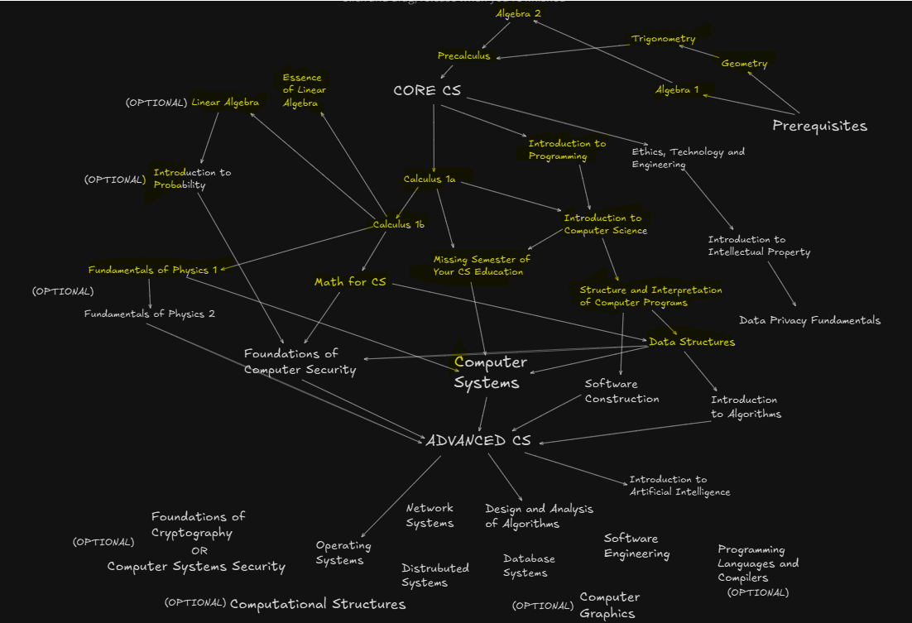

<!--
**edcedcedcedc/edcedcedcedc** is a ✨ _special_ ✨ repository because its `README.md` (this file) appears on your GitHub profile.

Here are some ideas to get you started:
- 📫 How to reach me: [LinkedIn](https://www.linkedin.com/in/androranogajec/) or [email](mailto:ranogaet@gmail.com).
- 🔭 I’m currently working on ...
- 🌱 I’m currently learning ...
- 👯 I’m looking to collaborate on ...
- 🤔 I’m looking for help with ...
- 💬 Ask me about ...
- 📫 How to reach me: ...
- 😄 Pronouns: ...
- ⚡ Fun fact: ...
-->

## Hi there 👋  

I am a software engineer, currently in my third year of Computer Science at OSSU, and a Google Summer of Code 2025 alumnus. I enjoy competitive programming, client-server programming, functional programming, object-oriented programming, event-driven programming, and math. I have a partial interest in game development and a strong foundation in Linux systems, which I use almost daily. I work with Python every other day and have professional experience with JavaScript/TypeScript. I have also completed academic projects in Java, C++, and a bit of Bash. I learn significantly by reading and analyzing others’ code, always striving to improve by imitating and adapting different approaches. I also contribute to open-source projects and open PRs, actively collaborating with developers to improve software, fix issues, and enhance functionality.

Directed acyclic graph of my computer science curriculum progress, vertices in yellow mean that the course is either done or in progress.

🔭 I’m excited to have been selected for [**GSoC 2025**](https://summerofcode.withgoogle.com/programs/2025/projects/RTuXxB1k) and study full-time at OSSU. Currently GSoC is my only source of support.
I still have about two years left to complete OSSU, and I'm working hard to become self-sufficient soon. Your support helps bridge that gap while I build skills, contribute to open source, and grow into a full-time software engineer. If you'd like to keep me caffeinated and coding - thank you ❤️.  

🌱 I’m studying two courses concurrently:  
• Introduction to Probability  
• Computer Systems A Programmer's Perspective 

👯 I’m open to collaborating on open-source projects.  
💬 Ask me about math, computer science, functional or object-oriented programming, and client-server systems.  
😄 Pronouns: He/Him  
⚡ Fun facts: I love cats, lifting weights, video games, coffee, chocolate, and surrounding myself with positive, driven people!

  This is probably my favourite cat picture on the internet! 
   

  ## A selection of my academic and personal projects
  A 3D object(cube) written in C++ and SDL3, projected into 2D and rotated using transformation matrices. [Source Code](https://github.com/edcedcedcedc/computer-science-curriculum-ossu/tree/master/advanced-cs/advanced-math/linear-algebra/spinningCube)

   

  A TCP/IP console application in Python, enabling client-server communication. [Source Code](https://github.com/edcedcedcedc/computer-science-curriculum-ossu/tree/master/core-cs/core-programming/sicp/projects/project2) 
  
   

   Recursive website file downloader in Python. [Source Code](https://github.com/edcedcedcedc/computer-science-curriculum-ossu/tree/master/core-cs/core-theory/data-structures/projects/download) 
  
   

