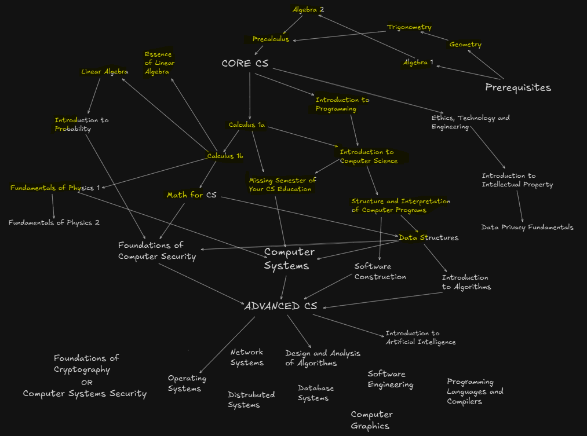

<!--
**edcedcedcedc/edcedcedcedc** is a ✨ _special_ ✨ repository because its `README.md` (this file) appears on your GitHub profile.

Here are some ideas to get you started:
- 📫 How to reach me: [LinkedIn](https://www.linkedin.com/in/androranogajec/) or [email](mailto:ranogaet@gmail.com).
- 🔭 I’m currently working on ...
- 🌱 I’m currently learning ...
- 👯 I’m looking to collaborate on ...
- 🤔 I’m looking for help with ...
- 💬 Ask me about ...
- 📫 How to reach me: ...
- 😄 Pronouns: ...
- ⚡ Fun fact: ...
-->

## Hi there 👋  

Software engineer with three years of experience, currently in my second year at [Open Source Society University](https://github.com/edcedcedcedc/computer-science-curriculum-ossu), Computer Science Curriculum. I enjoy competitive programming, client-server programming, functional programming, OO programming, event-driven programming, and math. I partially like game development and have a strong foundation in Linux systems, using it almost daily. I work with Python every other day and have past professional experience with JavaScript/TypeScript. I have also worked on academic projects using Java, C++, and a bit of Bash. I advance significantly by reading others' code or any code in general, always striving to learn and improve by imitating and analyzing different approaches. I also contribute to open-source projects and open PRs, actively collaborating with developers to improve software, fix issues, and enhance functionality.

Directed acyclic graph of my computer science curriculum progress, vertices in yellow mean that the course is either done or in progress.

🔭 I’m excited to have been selected for **GSoC 2025**! I’m also training to reach *Pupil* rank on Codeforces and studying full-time at OSSU.  
Currently, GSoC is my only source of support (and it hasn’t started yet). If you'd like to keep me caffeinated and coding — thank you ❤️.
I still have about two years left to complete OSSU, and I'm working hard to become self-sufficient soon.Your support helps bridge that gap while I build skills, contribute to open source, and grow into a full-time software engineer. 

🌱 I’m learning four courses concurrently:  
• Math for CS  
• Data Structures  
• Fundamentals of Physics I  
• Introduction to Probability

👯 I’m open to collaborating on open-source projects.  
💬 Ask me about math, computer science, functional or object-oriented programming, and client-server systems.  
😄 Pronouns: He/Him  
⚡ Fun facts: I love cats, lifting weights, video games, coffee, chocolate, and surrounding myself with positive, driven people!

  This is probably my favourite cat picture on the internet! 
   

  ## A selection of my academic and personal projects
  A 3D object(cube) written in C++ and SDL3, projected into 2D and rotated using transformation matrices. [Source Code](https://github.com/edcedcedcedc/computer-science-curriculum-ossu/tree/master/advanced-cs/advanced-math/linear-algebra/spinningCube)

   

  A TCP/IP console application in Python, enabling client-server communication. [Source Code](https://github.com/edcedcedcedc/computer-science-curriculum-ossu/tree/master/core-cs/core-programming/sicp/projects/project2) 
  
   

   Recursive website file downloader in Python. [Source Code](https://github.com/edcedcedcedc/computer-science-curriculum-ossu/tree/master/core-cs/core-theory/data-structures/projects/download) 
  
   

