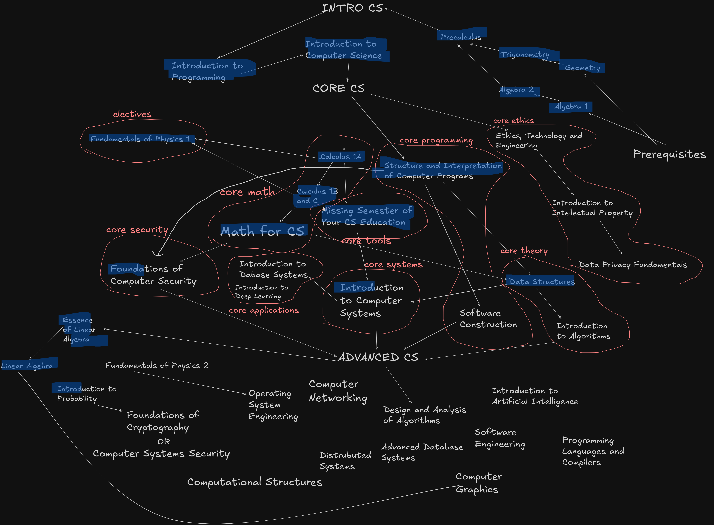

<!--
**edcedcedcedc/edcedcedcedc** is a ✨ _special_ ✨ repository because its `README.md` (this file) appears on your GitHub profile.

Here are some ideas to get you started:
- 📫 How to reach me: [LinkedIn](https://www.linkedin.com/in/androranogajec/) or [email](mailto:ranogaet@gmail.com).
- 🔭 I’m currently working on ...
- 🌱 I’m currently learning ...
- 👯 I’m looking to collaborate on ...
- 🤔 I’m looking for help with ...
- 💬 Ask me about ...
- 📫 How to reach me: ...
- 😄 Pronouns: ...
- ⚡ Fun fact: ...
-->

## Hi there 👋  

I am a software engineer, currently in my third year at [Open Source Society University](https://cs.ossu.dev/) pursuing Open Education in Computer Science, and a Google Summer of Code 2025 alumnus. I enjoy competitive programming, client-server programming, functional programming, object-oriented programming, event-driven programming, and mathematics. I have a partial interest in game development and a strong foundation in Linux systems, which I use almost daily. I work with Python every other day and have professional experience with JavaScript/TypeScript. I have also completed academic projects in Java, C++, and a bit of Bash. I learn significantly by reading and analyzing others’ code, always striving to improve by imitating and adapting different approaches. I also contribute to open-source projects and open PRs, actively collaborating with developers to improve software, fix issues, and enhance functionality.

- 🌱 Currently learning Probability for Computer Scientists, Introduction to Computer Systems, and Foundations of Computer Security  
- 🔭 Part time volunteer software engineer for [Ruqola](https://github.com/KDE/ruqola), working on E2EE (C++/Qt6/KF6)  
- 👯 Open to collaborating on open-source projects  
- 🚀 [Google Summer of Code 2025](https://summerofcode.withgoogle.com/programs/2025/projects/RTuXxB1k) alumnus  
- 💬 Ask me about computer science, math, game development, or debugging - the Rocket.Chat team dubbed me a “professional bug researcher” at the end of GSoC 2025 😄

This is probably my favourite cat picture on the internet!  

A graph showing my current [progress](https://github.com/edcedcedcedc/computer-science-curriculum-ossu):  

---

## Selected projects

- 3D spinning cube in C++/SDL3 ([source](https://github.com/edcedcedcedc/computer-science-curriculum-ossu/tree/master/advanced-cs/advanced-math/linear-algebra/spinningCube))  
  

- TCP/IP console client-server app in Python ([source](https://github.com/edcedcedcedc/computer-science-curriculum-ossu/tree/master/core-cs/core-programming/sicp/projects/project2))  
  

- Recursive website downloader in Python ([source](https://github.com/edcedcedcedc/computer-science-curriculum-ossu/tree/master/core-cs/core-theory/data-structures/download))  
  
