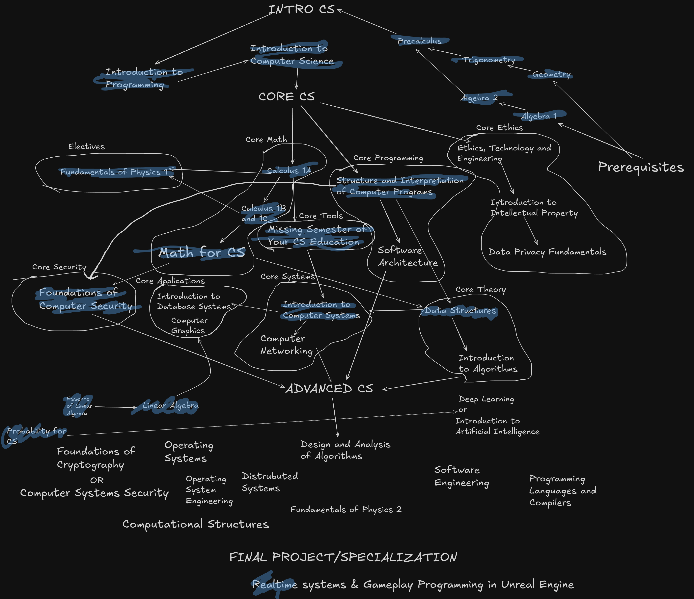
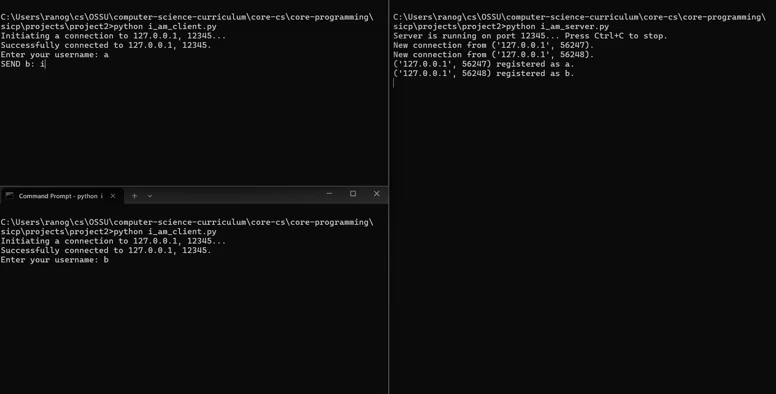
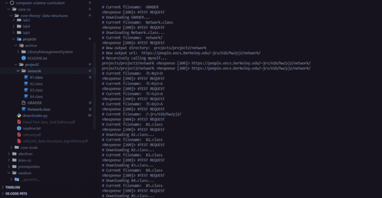

<!--
**edcedcedcedc/edcedcedcedc** is a ✨ _special_ ✨ repository because its `README.md` (this file) appears on your GitHub profile.

Here are some ideas to get you started:
- 📫 How to reach me: [LinkedIn](https://www.linkedin.com/in/androranogajec/) or [email](mailto:ranogaet@gmail.com).
- 🔭 I’m currently working on ...
- 🌱 I’m currently learning ...
- 👯 I’m looking to collaborate on ...
- 🤔 I’m looking for help with ...
- 💬 Ask me about ...
- 📫 How to reach me: ...
- 😄 Pronouns: ...
- ⚡ Fun fact: ...
-->
### Hi there 👋  

I’m a software engineer and a general-purpose programmer with experience in web and game development. I’m stack-agnostic, highly flexible, and currently in my third year at the [Open Source Society University](https://cs.ossu.dev/), pursuing Open Education in Computer Science, and a [Google Summer of Code 2025](https://summerofcode.withgoogle.com/programs/2025/projects/RTuXxB1k) alumnus, where I helped build an end-to-end encryption system.

- 🌱 Currently learning Probability for Computer Scientists, Introduction to Computer Systems, and Foundations of Computer Security, while deepening my focus on game development and Unreal Engine 
- 🔭 Part-time volunteer software engineer for [Ruqola](https://github.com/KDE/ruqola), working on E2EE (C++/Qt6/KF6)  
- 💬 Ask me about game development, computer science, math,  or debugging - the Rocket.Chat team once dubbed me a *“professional bug researcher”* 😄 

This is probably my favourite cat picture on the internet!  

A graph showing my [progress](https://github.com/edcedcedcedc/computer-science-curriculum-ossu)!

- Spinning cube in C++/SDL3 ([source](https://github.com/edcedcedcedc/computer-science-curriculum-ossu/tree/master/advanced-cs/advanced-math/linear-algebra/spinningCube))  
  

- TCP/IP console client-server app in Python ([source](https://github.com/edcedcedcedc/computer-science-curriculum-ossu/tree/master/core-cs/core-programming/sicp/projects/project2))  
  

- Recursive website downloader in Python ([source](https://github.com/edcedcedcedc/computer-science-curriculum-ossu/tree/master/core-cs/core-theory/data-structures/download))  
  
