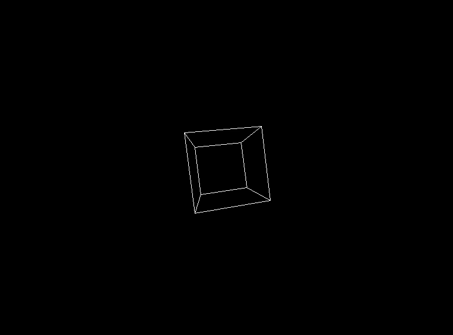

<!--
**edcedcedcedc/edcedcedcedc** is a ✨ _special_ ✨ repository because its `README.md` (this file) appears on your GitHub profile.

Here are some ideas to get you started:
- 📫 How to reach me: [LinkedIn](https://www.linkedin.com/in/androranogajec/) or [email](mailto:ranogaet@gmail.com).
- 🔭 I’m currently working on ...
- 🌱 I’m currently learning ...
- 👯 I’m looking to collaborate on ...
- 🤔 I’m looking for help with ...
- 💬 Ask me about ...
- 📫 How to reach me: ...
- 😄 Pronouns: ...
- ⚡ Fun fact: ...
-->

## Hi there 👋  

I'm a software engineer, with three years of experience, which includes academic projects, personal initiatives, and one and a half years of professional experience in frontend developement. At current time I am in my second-year of the [Open Source Society University](https://github.com/edcedcedcedc/computer-science-curriculum-ossu) Computer Science Curriculum. I enjoy competitive programming using Python, low level programming in C, C++, a bit of Bash, game development, web programming in Java and Javascript on either client or server side.

Directed acyclic graph of my computer science curriculum progress, vertices in yellow mean that the course is either done or in progress.

- 🔭 Right now I am writing Project 1 for Data Structures class on image blurring and edge detection, and mostly try to advance to pupil at Codeforces using Python.
- 🌱 I’m learning five courses concurrently at Open Source Society University, Math For CS, Calculus 1b, Data Structures, Fundamentals of Physics I, Introduction to Probability
- 👯 I’m open to collaborating on open-source projects.
- 💬 Ask me about math, cs, functional programming, object-oriented programming, client-server programming. 
- 😄 Pronouns: He/Him
- ⚡ Fun facts: I love cats, pushing weights, video games, coffee, chocolate, and being around positive and motivated people!

  This is probably my favourite cat picture on the internet! 
   
  ## A selection of my academic and personal projects
  A 3D object(cube) written in C++ and SDL3, projected into 2D and rotated using transformation matrices. [Source Code](https://github.com/edcedcedcedc/computer-science-curriculum-ossu/tree/master/advanced-cs/advanced-math/linear-algebra/spinningCube)

   

  A TCP/IP console application in Python, enabling client-server communication. [Source Code](https://github.com/edcedcedcedc/computer-science-curriculum-ossu/tree/master/core-cs/core-programming/sicp/projects/project2) 
  
   

