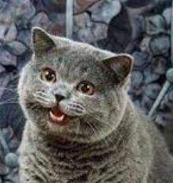

<!--
**edcedcedcedc/edcedcedcedc** is a ✨ _special_ ✨ repository because its `README.md` (this file) appears on your GitHub profile.

Here are some ideas to get you started:
- 📫 How to reach me: [LinkedIn](https://www.linkedin.com/in/androranogajec/) or [email](mailto:ranogaet@gmail.com).
- 🔭 I’m currently working on ...
- 🌱 I’m currently learning ...
- 👯 I’m looking to collaborate on ...
- 🤔 I’m looking for help with ...
- 💬 Ask me about ...
- 📫 How to reach me: ...
- 😄 Pronouns: ...
- ⚡ Fun fact: ...
-->

## Hi there 👋  

I am a software engineer, currently in my third year at Open Source Society University pursuing Open Education in Computer Science, and a Google Summer of Code 2025 alumnus. I enjoy competitive programming, client-server programming, functional programming, object-oriented programming, event-driven programming, and mathematics. I have a partial interest in game development and a strong foundation in Linux systems, which I use almost daily. I work with Python every other day and have professional experience with JavaScript/TypeScript. I have also completed academic projects in Java, C++, and a bit of Bash. I learn significantly by reading and analyzing others’ code, always striving to improve by imitating and adapting different approaches. I also contribute to open-source projects and open PRs, actively collaborating with developers to improve software, fix issues, and enhance functionality.

🌱 I’m studying three courses concurrently:  
• Introduction to Probability  
• Computer Systems A Programmer's Perspective  
• Foundations of Computer Security

👯 I’m open to collaborating on open-source projects.  
💬 Ask me about math, computer science, functional or object-oriented programming, and client-server systems.  
😄 Pronouns: He/Him  
⚡ Fun facts: I love cats, lifting weights, video games, coffee, chocolate, and surrounding myself with positive, driven people!

  This is my favourite cat picture on the internet! 
   

  ## A selection of my academic and personal projects
  A 3D object(cube) written in C++ and SDL3, projected into 2D and rotated using transformation matrices. [Source Code](https://github.com/edcedcedcedc/computer-science-curriculum-ossu/tree/master/advanced-cs/advanced-math/linear-algebra/spinningCube)

   

  A TCP/IP console application in Python, enabling client-server communication. [Source Code](https://github.com/edcedcedcedc/computer-science-curriculum-ossu/tree/master/core-cs/core-programming/sicp/projects/project2) 
  
   

   Recursive website file downloader in Python. [Source Code](https://github.com/edcedcedcedc/computer-science-curriculum-ossu/tree/master/core-cs/core-theory/data-structures/projects/download) 
  
   

